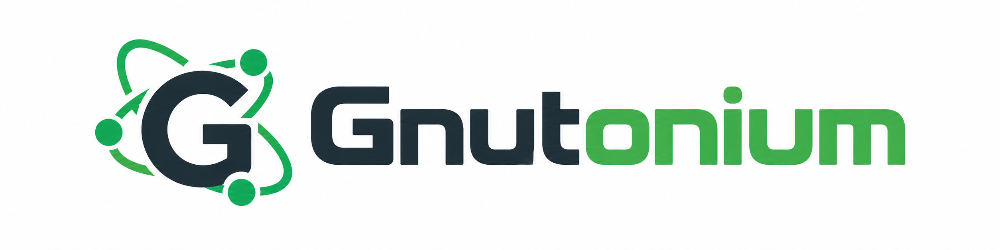

# Gnutonium



Gnutonium is a small Bun-based Gnutella client you can run from the terminal or embed in a TypeScript app.

Gnutonium is compatible with major clients like GTK-Gnutella, Phex, Shareaza and others.

It allows you to:

- share files from a downloads folder
- search the Gnutella network
- browse peer's shared files
- manage downloads (pause/resume/cancel)

It can be used in three ways:

- as an interactive CLI
- as a scripted CLI runner
- as a library inside another app

## Prebuilt Binaries

- [Windows](https://github.com/RickCarlino/gnutella-bun-client/releases/latest/download/gnutonium-windows-x64.exe)
- [Windows (older CPUs)](https://github.com/RickCarlino/gnutella-bun-client/releases/latest/download/gnutonium-windows-x64-baseline.exe)
- [macOS Intel](https://github.com/RickCarlino/gnutella-bun-client/releases/latest/download/gnutonium-darwin-x64)
- [macOS Apple Silicon](https://github.com/RickCarlino/gnutella-bun-client/releases/latest/download/gnutonium-darwin-arm64)
- [Linux builds](https://github.com/RickCarlino/gnutella-bun-client/releases)
- [All releases](https://github.com/RickCarlino/gnutella-bun-client/releases)

Download a prebuilt executable from the [releases page](https://github.com/RickCarlino/gnutella-bun-client/releases).

Older releases use the GnutellaBun name and `gnutella-bun-*` filenames.

After downloading a Gnutonium build, run the executable directly:

```bash
./gnutonium-linux-x64 init --config gnutella.json
./gnutonium-linux-x64 run --config gnutella.json
```

## Install From npm

Gnutonium requires Bun 1.4.2 or newer for inbound TLS upgrades, including when installed through npm.

```bash
npm install -g gnutonium
gnutonium init --config gnutella.json
gnutonium run --config gnutella.json
```

## From Source

If you want to run from source:

```bash
bun install
bun run bin/gnutonium.ts init --config gnutella.json
bun run bin/gnutonium.ts run --config gnutella.json
```

## Library Use

Install the library with `npm install gnutonium` and run it with Bun. The npm package and CLI command are both named `gnutonium`. The public TypeScript import is:

```ts
import { GnutellaServent, loadDoc } from "gnutonium";

const configPath = "./gnutella.json";
const doc = await loadDoc(configPath);
const node = new GnutellaServent(configPath, doc);

await node.start();
node.sendQuery("hello world");
```

The default config filename remains `gnutella.json` so existing settings and saved state continue to work. Gnutonium identifies itself on the network with vendor code `NIUM`.

## Guides

- [Quickstart](QUICKSTART.md): get the CLI working in a few minutes
- [CLI Guide](CLI.md): full command and config reference
- [Developer Guide](DEVELOPER.md): embed Gnutonium and follow the source reading guide

## License

Gnutonium is released under the GNU General Public License v3.0. See [LICENSE](LICENSE).
